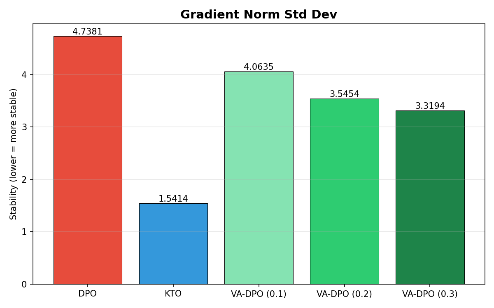

# Variance-Aware DPO: Investigating Gradient Stability in Preference Optimization at Small Model Scales

**Shirish Krishna**  
Amrita Vishwa Vidyapeetham  
shirishkrishna2003@gmail.com

---

## Abstract

Direct Preference Optimization (DPO) has become a widely adopted approach for aligning language models with human preferences, but its gradient dynamics at small model scales (1–2B parameters) are not well understood. In this work we empirically compare DPO and Kahneman-Tversky Optimization (KTO) on Qwen2-1.5B-Instruct using QLoRA fine-tuning, and propose Variance-Aware DPO (VA-DPO), a lightweight gradient controller that modulates update magnitudes based on step-to-step changes in gradient norm. Experiments on UltraFeedback demonstrate that VA-DPO reduces gradient norm standard deviation by up to 30%, mean step-to-step gradient fluctuations by 36%, and worst-case gradient spikes by 57% compared to the DPO baseline, while preserving reward accuracy and margin separation. Despite these stability improvements, alignment quality metrics remain comparable to standard DPO, suggesting that gradient magnitude alone is an insufficient signal for reshaping preference optimization dynamics. We report this as an informative result and discuss directions for richer gradient-level control.

---

## 1. Introduction

Reinforcement Learning from Human Feedback (RLHF) [Ouyang et al., 2022] has been central to aligning large language models with human intent, but its practical requirements — a separately trained reward model and a PPO training loop [Schulman et al., 2017] — impose substantial engineering overhead. Direct Preference Optimization (DPO) [Rafailov et al., 2023] eliminates this overhead by reformulating preference learning as a classification problem directly over human preference data, achieving competitive alignment quality with a simpler training procedure.

Despite this simplicity, DPO's gradient dynamics exhibit properties that are not always benign. The DPO loss involves a sigmoid over the difference in log-ratios between a trained policy and a frozen reference model. The resulting gradient magnitude scales as $(1 - \sigma(h))$, where $h$ is the implicit reward margin. On ambiguous preference pairs where chosen and rejected responses are of similar quality, this coefficient approaches $0.5$ and produces large gradient updates; on clearly separable pairs it shrinks toward zero. The consequence is that batch-to-batch variation in preference difficulty translates directly into variability in gradient magnitude across training steps — an effect that becomes more pronounced at smaller model scales, where individual batches have greater relative influence on the parameter trajectory.

Kahneman-Tversky Optimization (KTO) [Ethayarajh et al., 2024] approaches alignment differently, training on unpaired binary labels rather than pairwise preferences. This structural difference removes the batch-level antagonism between chosen and rejected responses and produces substantially more stable gradient dynamics. However, KTO's stability comes at the cost of weaker explicit preference separation, since the objective never directly maximises the margin between a chosen and a rejected response on the same prompt.

This observation motivates a natural question: is it possible to reduce DPO's gradient variability without abandoning its pairwise comparison structure — and if so, does doing so improve downstream alignment quality? This paper investigates both questions empirically through Variance-Aware DPO (VA-DPO), a lightweight gradient controller applied on top of standard DPO training.

**Contributions.** We make the following contributions:

1. An empirical comparison of DPO and KTO gradient stability characteristics at 1.5B parameter scale, quantifying the stability-discrimination tradeoff using multiple gradient-level metrics.
2. VA-DPO, a simple step-to-step gradient norm controller that reduces gradient variance monotonically with regularisation strength while preserving preference alignment metrics.
3. An honest empirical finding: gradient magnitude stabilisation does not translate into improved alignment quality under our experimental conditions, motivating future work that incorporates directional or semantic gradient signals.

---

## 2. Background

### 2.1 Direct Preference Optimization

DPO [Rafailov et al., 2023] derives a closed-form training objective from the RLHF reward maximisation problem under a KL constraint. Given a prompt $x$, a chosen response $y_w$, and a rejected response $y_l$, DPO minimises:

$$\mathcal{L}_{\text{DPO}}(\theta) = -\mathbb{E}\left[\log \sigma\!\left(\beta\left[\log\frac{\pi_\theta(y_w|x)}{\pi_{\text{ref}}(y_w|x)} - \log\frac{\pi_\theta(y_l|x)}{\pi_{\text{ref}}(y_l|x)}\right]\right)\right]$$

where $\pi_\theta$ is the trained policy, $\pi_{\text{ref}}$ is a frozen reference model, and $\beta$ controls KL regularisation strength. The implicit reward for a response $y$ is $r_\theta(x,y) = \beta\log(\pi_\theta(y|x)/\pi_{\text{ref}}(y|x))$. Training directly maximises the margin $r_\theta(x, y_w) - r_\theta(x, y_l)$, making pairwise preference data the primary training signal.

### 2.2 Kahneman-Tversky Optimization

KTO [Ethayarajh et al., 2024] draws on prospect theory to formulate alignment without requiring pairwise preferences. Each training sample is an independent tuple $(x, y, \text{label})$ where label $\in \{\text{desirable}, \text{undesirable}\}$. The objective independently pushes desirable responses above and undesirable responses below a KL-regularised reference threshold, without ever comparing a specific chosen response against a specific rejected response on the same prompt. This independence between samples is the structural source of KTO's lower gradient variance.

### 2.3 Gradient Stability in Fine-Tuning

Gradient norm explosions and oscillations are a known challenge in training recurrent networks [Pascanu et al., 2013] and have been studied in the context of pre-training large models. Adaptive clipping approaches such as AutoClip [Seetharaman et al., 2020] and ZClip [Kumar et al., 2025] address norm instability by maintaining a history of past gradient norms and clipping based on statistical properties of that history. The fine-tuning setting — and the DPO fine-tuning setting specifically — has received less attention from this perspective. VA-DPO is motivated by the specific temporal pattern of gradient oscillations observed in DPO at small scales, where gradient norms spike and recover repeatedly across training steps rather than trending monotonically.

---

## 3. Method: Variance-Aware DPO

### 3.1 Motivation

The gradient of the DPO loss with respect to $\theta$ scales as $(1 - \sigma(h))$, where $h$ is the current reward margin on a given batch. When the batch contains ambiguous preference pairs, $h \approx 0$ and the gradient is large. When pairs are easily separable, the gradient is small. Real preference datasets contain both, and their distribution varies across batches. This produces step-to-step gradient norm oscillations that are characteristic of DPO training and more prominent at small model scales, where individual batch effects are proportionally larger.

KTO avoids this through its unpaired objective but trades it for weaker preference separation. VA-DPO asks whether a lightweight post-hoc controller applied to DPO gradients can achieve a better tradeoff — reducing the gradient norm variability without altering the pairwise loss structure.

### 3.2 Controller Formulation

Let $\|g_t\|$ denote the L2 gradient norm at training step $t$ over all trainable parameters. The signed step-to-step change is:

$$\Delta g_t = \|g_t\| - \|g_{t-1}\|$$

The sign is retained in the controller — it determines whether gradients are dampened or boosted. The reported evaluation metric Mean $|\Delta g_t|$ is the absolute version and is a separate quantity from $\Delta g_t$ used here.

VA-DPO computes a scalar modulation factor:

$$\alpha_t = -\lambda \cdot \frac{2\,\Delta g_t}{\|g_t\|}$$

and applies it to scale current gradients before the optimiser update:

$$g'_t = (1 + \alpha_t) \cdot g_t$$

When the gradient norm spikes ($\Delta g_t > 0$), $\alpha_t < 0$ and the update is dampened. When the norm drops ($\Delta g_t < 0$), $\alpha_t > 0$ and the update receives a slight boost. At $\Delta g_t \approx 0$ the controller is inactive, and at $\lambda = 0$ the method reduces exactly to standard DPO.

The modulation factor is clamped to $[-0.3, 0.3]$ before application to prevent destabilising feedback in early training steps. The regularisation strength $\lambda$ is a hyperparameter; we evaluate $\lambda \in \{0.1, 0.2, 0.3\}$.

This formulation is a first-order heuristic approximation. The exact gradient of the penalty $\lambda(\|g_t\| - \|g_{t-1}\|)^2$ with respect to $\theta$ requires differentiating through the gradient computation itself, which is infeasible under QLoRA. The controller is presented as a motivated approximation and not as an exact optimisation of the stated penalty.

### 3.3 Implementation Considerations

**Mixed-precision gradient unscaling.** In fp16 training, PyTorch's `GradScaler` multiplies all gradients by a large scale factor (typically $2^{16}$) immediately after the backward pass to prevent fp16 underflow [Micikevicius et al., 2018]. Reading `p.grad` directly at this point yields values inflated by this factor, rendering gradient norm measurements meaningless for the controller. We obtain true gradient norms by dividing the raw computed norm by the current scale factor prior to the controller computation:

```python
scaler = getattr(self.accelerator, 'scaler', None)
if scaler is not None:
    scale = scaler.get_scale()
    if scale > 0:
        raw_norm = raw_norm / scale
```

Early VA-DPO runs that omitted this correction produced $|\Delta g|$ values on the order of $10^5$ and penalty values exceeding $10^8$, rendering those runs invalid. All results reported in this paper use the corrected implementation.

**Zero CPU-GPU synchronisation.** Computing gradient norms with `.item()` calls forces a CPU-GPU synchronisation at each training step, introducing overhead that scales with training duration. To avoid this synchronisation overhead, all controller arithmetic — norm computation, modulation factor, and gradient scaling — is executed entirely in GPU tensor space using in-place PyTorch operations, ensuring no additional CPU-GPU synchronisations are introduced during the training loop.

---

## 4. Experimental Setup

### 4.1 Model and Dataset

All experiments use **Qwen2-1.5B-Instruct** [Yang et al., 2024] as the base model. This scale was chosen deliberately: most published DPO evaluations operate at 7B parameters or above, and the 1–2B range is less studied despite its relevance to resource-constrained practitioners.

The preference dataset is **UltraFeedback Binarized** [Cui et al., 2023] (`trl-lib/ultrafeedback_binarized`), a large-scale synthetic preference dataset constructed from GPT-4 feedback on diverse instruction-following tasks. We sample 5,000 training examples uniformly at random (seed 42) from the training split. For KTO, each pairwise example is converted into two unpaired samples — one desirable, one undesirable — yielding 10,000 individual training instances from the same underlying preference information.

### 4.2 Training Configuration

All methods are fine-tuned using **QLoRA** [Dettmers et al., 2023] with 4-bit NF4 quantisation and double quantisation enabled. The LoRA [Hu et al., 2021] configuration is identical across methods: rank $r=16$, scaling $\alpha=32$, dropout 0.05, applied to all attention projection layers and feed-forward gate, up, and down projections.

Training uses paged AdamW 32-bit at learning rate $1 \times 10^{-6}$ with KL penalty $\beta=0.1$ for all methods. All runs are trained for **200 steps** with metrics logged every 10 steps, yielding 20 logged checkpoints per run. Effective batch size is 2 across all methods (DPO and VA-DPO: device batch size 1 with 2 gradient accumulation steps; KTO: device batch size 2 with no accumulation). Maximum sequence length is 512 tokens with maximum prompt length 256. All runs use fp16 mixed precision. The default linear learning rate decay schedule from HuggingFace Transformers was used; no multi-seed replication was performed.

### 4.3 Evaluation Metrics

**Alignment metrics:**

- *Reward Accuracy*: fraction of logged steps in which the model assigns higher implicit reward to the chosen response. Reported as mean and final logged value. Not applicable to KTO.
- *Reward Margin*: mean $r_\theta(x, y_w) - r_\theta(x, y_l)$ per batch. Reported as mean across all logged steps. For KTO, the trainer's internal reward estimates are included for reference; these should be interpreted cautiously as KTO trains on unpaired signals.

**Stability metrics:**

- *Gradient Norm Std*: sample standard deviation ($\text{ddof}=1$) of per-step gradient norms across all logged steps.
- *Mean* $|\Delta g|$: mean absolute step-to-step change in gradient norm.
- *Std* $|\Delta g|$: standard deviation of per-step absolute gradient norm changes.
- *Loss Std Dev*: sample standard deviation ($\text{ddof}=1$) of training loss across logged steps.

---

## 5. Results

Table 1 presents all metrics across DPO, KTO, and VA-DPO ($\lambda \in \{0.1, 0.2, 0.3\}$).

| Method | Mean Loss | Loss Std | Grad Norm Std | Mean \|Δg\| | Std \|Δg\| | Reward Acc (Mean) | Margin (Mean) |
|:---|:---:|:---:|:---:|:---:|:---:|:---:|:---:|
| DPO | 0.69079 | 0.00220 | 4.7381 | 5.1168 | 5.0078 | 60.0% | 0.00478 |
| KTO | 0.49967 | 0.00052 | 1.5414 | — | — | — | 0.00065 |
| VA-DPO λ=0.1 | 0.69084 | 0.00216 | 4.0635 | 4.3381 | 3.7368 | 58.0% | 0.00474 |
| VA-DPO λ=0.2 | 0.69124 | 0.00193 | 3.5454 | 3.6929 | 2.7120 | 58.0% | 0.00391 |
| VA-DPO λ=0.3 | 0.69103 | 0.00195 | 3.3194 | 3.2535 | 2.0936 | 60.0% | 0.00432 |

*Table 1. All metrics are means over 20 logged checkpoints (200 steps, logged every 10). Grad Norm Std and Loss Std use sample standard deviation (ddof=1). KTO reward margin uses the trainer's internal reward estimates on unpaired signals; the final-step value (−0.00779) is omitted as a single-point measurement at 200 steps. KTO does not expose paired reward accuracy.*


*Figure 1. Gradient Norm Std Dev across methods. Shows monotonic reduction (DPO = 4.74, VA-0.1 = 4.06, VA-0.2 = 3.55, VA-0.3 = 3.32). This primary result serves as direct evidence that VA-DPO is doing what it was designed to do.*


*Figure 2. Mean Reward Margin across methods. Shows that preference learning quality remains largely preserved, directly supporting the claim that stability improvements do not substantially degrade alignment performance. This is arguably the most important figure alongside Figure 1.*


*Figure 3. Gradient Norm over training steps. A qualitative visualization letting readers visually observe the large spikes in DPO, how VA-DPO smooths these fluctuations, and the natural stability of KTO, making the results intuitive.*

### 5.1 Gradient Stability

VA-DPO reduces all three gradient stability metrics monotonically as $\lambda$ increases. Gradient Norm Std decreases from 4.738 (DPO) to 4.064, 3.545, and 3.319 at $\lambda = 0.1, 0.2, 0.3$ — a **30% reduction** at maximum regularisation. Mean $|\Delta g|$ decreases from 5.117 to 3.254, a **36% reduction**. The standard deviation of $|\Delta g|$ decreases from 5.008 to 2.094, a **58% reduction**, indicating that not only is the average step-to-step fluctuation smaller, but extreme gradient changes become substantially less frequent.

Monotonicity across the full $\lambda$ sweep on all three metrics is consistent with the controller behaving as designed: stronger regularisation produces proportionally greater damping. The maximum observed gradient norm also decreases monotonically: 27.60 (DPO), 25.13, 23.15, 21.48 (VA-DPO $\lambda=0.3$).

### 5.2 Alignment Quality

Despite progressive gradient modulation, VA-DPO largely preserves DPO's preference learning capability. Mean reward accuracy is 60.0% for DPO versus 58%, 58%, 60% for VA-DPO at $\lambda = 0.1, 0.2, 0.3$. Given the small sample size of 20 logged steps and the absence of multi-seed replication, these differences are not statistically distinguishable.

Mean reward margins follow a similar pattern. DPO achieves 0.00478; VA-DPO at $\lambda=0.1$ preserves this at 0.00474. At $\lambda=0.2$ the margin decreases to 0.00391, and at $\lambda=0.3$ it partially recovers to 0.00432. The non-monotonic margin behaviour across $\lambda$ values, together with single-seed measurements, means these differences should not be over-interpreted. The cleaner summary is that $\lambda=0.1$ delivers meaningful gradient stability gains — 14% reduction in Grad Norm Std, 15% in Mean $|\Delta g|$ — at negligible cost to alignment metrics.

Loss trajectories across DPO and all VA-DPO runs are nearly identical (mean losses 0.690–0.691, Loss Std 0.00193–0.00220), confirming that the controller does not substantially displace the primary DPO optimisation objective.

### 5.3 DPO vs KTO Baseline Comparison

KTO achieves dramatically lower gradient variance than DPO: Grad Norm Std 1.541 versus 4.738, approximately a 67% reduction. Loss Std is similarly lower: 0.00052 versus 0.00220. This confirms that KTO's structural properties — independent per-sample updates, no pairwise batch antagonism — produce substantially more stable optimisation dynamics.

However, KTO's mean reward margin is 0.00065 versus DPO's 0.00478, approximately a 7× reduction in preference separation. VA-DPO at $\lambda=0.3$ narrows the stability gap (Grad Norm Std 3.319 versus KTO's 1.541) while maintaining DPO-level preference margins, suggesting that the stability-discrimination tradeoff is not fixed but can be partially decoupled through gradient-level intervention.

---

## 6. Discussion

### 6.1 Stability Improvements Are Real but Orthogonal to Alignment

The central empirical finding of this work is a dissociation: VA-DPO produces consistent, monotonic improvements in gradient stability metrics — Grad Norm Std (−30%), Mean $|\Delta g|$ (−36%), Std $|\Delta g|$ (−58%) — without producing corresponding improvements in reward accuracy or reward margin. At $\lambda=0.1$ alignment metrics are nearly identical to baseline DPO; at higher $\lambda$ values, margins show modest degradation.

This result is informative precisely because it is not a clean success story. It suggests that the instability observable in DPO gradient norms — the spike-and-recover patterns across training steps — does not substantially harm preference learning at this scale and training duration. Gradient norm variance may be a symptom of DPO's pairwise loss structure rather than a cause of alignment quality degradation.

### 6.2 What Gradient Magnitude Alone Cannot Capture

The controller operates on a scalar signal: the step-to-step change in gradient norm. This signal carries no information about gradient direction, no information about the semantic relationship between preference pairs in a given batch, and no information about reward confidence or preference uncertainty. The same gradient norm change can arise from a batch of highly informative preference pairs (where a large update is appropriate) or from numerical noise (where dampening is appropriate). The controller cannot distinguish between these cases.

This suggests that more effective gradient-level control for preference optimisation would need to incorporate richer signals. Gradient cosine similarity between consecutive steps could distinguish directional consistency from mere magnitude changes. Difficulty-aware batch weighting, conditioned on reward margin distributions, could selectively modulate updates for ambiguous preference pairs rather than applying uniform scaling. Semantic similarity between current and historical preference examples could enable a form of experience-based update routing. We leave these directions to future work.

### 6.3 The λ Tradeoff

The $\lambda$ sweep reveals an asymmetry in the stability-alignment tradeoff. Stability metrics improve monotonically and substantially across the full range. Alignment metrics are relatively flat at $\lambda=0.1$ and show moderate degradation at $\lambda=0.2$ before partially recovering at $\lambda=0.3$. This non-monotonic alignment behaviour, combined with single-seed measurements, makes it difficult to identify a single optimal $\lambda$. Practically, $\lambda=0.1$ appears to be the safest operating point: it captures the majority of stability gains at the low end of the sweep while presenting the least alignment risk.

---

## 7. Related Work

**DPO and its variants.** DPO [Rafailov et al., 2023] established the direct optimisation paradigm for preference learning. IPO [Azar et al., 2023] introduced identity-based preference objectives to address reward overfitting. KTO [Ethayarajh et al., 2024] extended this family to unpaired binary feedback, motivated by prospect theory. These methods differ structurally in how they use preference data; VA-DPO differs primarily in targeting temporal gradient fluctuations during preference optimisation, operating at the gradient level rather than modifying the loss formulation.

**Adaptive gradient clipping.** AutoClip [Seetharaman et al., 2020] introduced the idea of setting gradient clipping thresholds based on a percentile of the historical distribution of gradient norms, rather than a fixed constant. ZClip [Kumar et al., 2025] extended this with EMA-based z-score anomaly detection for pre-training workloads. LAMB [You et al., 2020] adapts update magnitudes per parameter group using gradient norm ratios. VA-DPO differs from these methods in two respects: it targets step-to-step norm *change* rather than absolute norm magnitude, and it is applied in the DPO preference fine-tuning setting where gradient dynamics are driven by preference difficulty distributions rather than pre-training data statistics.

**Gradient dynamics in preference optimisation.** Recent work has characterised pathological gradient behaviour in DPO training. The ICLR 2025 literature identifies displacement and degradation phenomena in DPO fine-tuning, where chosen and rejected response likelihoods drift in undesirable ways. Gradient-gated DPO approaches address these pathologies through gating mechanisms on the gradient flow. VA-DPO takes a simpler approach — scalar norm modulation — and reports the limits of this simplicity empirically.

**Mixed-precision training.** The GradScaler mechanism used in fp16 training [Micikevicius et al., 2018] scales gradients to prevent underflow and must be accounted for when reading gradient values directly. This is a practical consideration for any method that operates on raw gradient tensors during training, and the unscaling fix described in Section 3.3 generalises to other gradient-level interventions in fp16 fine-tuning contexts.

---

## 8. Limitations

**Single seed.** All experiments use a single random seed. The non-monotonic reward margin behaviour across $\lambda$ values — and small differences in accuracy — should be interpreted with caution; multi-seed replication is necessary to establish statistical reliability.

**Single model and dataset.** All results are from Qwen2-1.5B-Instruct on UltraFeedback. Whether the DPO gradient instability pattern and VA-DPO's response to it generalise to other small models (Phi-3-mini, Gemma-2B, LLaMA-3.2-1B) or other preference datasets is unknown.

**Short training runs.** 200 steps with QLoRA is sufficient for comparative signal under identical conditions but is not representative of production fine-tuning. Reward margin values in this range are substantially smaller than those reported in full-scale alignment runs, and it is unclear how the stability-alignment tradeoff evolves over longer training horizons.

**No downstream evaluation.** We evaluate on training-time metrics only. Whether gradient stability improvements at 200 steps correspond to any measurable difference in downstream generation quality — as measured by MT-Bench, AlpacaEval, or similar benchmarks — is not established by this work.

**Heuristic approximation.** The gradient modulation formula is a first-order approximation to the exact penalty gradient, which would require second-order derivatives. The approximation is motivated but not derived from a theoretical optimality condition.

---

## 9. Conclusion

We presented an empirical investigation of gradient stability in DPO and KTO fine-tuning at 1.5B parameter scale, and proposed VA-DPO, a lightweight step-to-step gradient norm controller. Experiments on Qwen2-1.5B-Instruct with UltraFeedback demonstrated that VA-DPO reduces gradient norm standard deviation by 30%, mean step-to-step fluctuations by 36%, and the variability of those fluctuations by 58%, all monotonically with regularisation strength. Reward accuracy and margin separation remain largely unchanged relative to the DPO baseline, with $\lambda=0.1$ providing the best stability-alignment tradeoff among tested configurations.

The primary finding is a dissociation: measurable gradient stability improvements do not translate into measurable alignment gains under our experimental conditions. This suggests that gradient norm oscillations in DPO, while real and quantifiable, may not be the limiting factor for preference learning quality at short fine-tuning runs on small models. More expressive gradient signals — incorporating direction, semantic content, or preference difficulty — may be necessary to produce interventions that reshape alignment outcomes rather than update magnitude distributions.

Code and experimental artefacts are available at: [github.com/Shirishkrish23]

---

## References

Azar, M. G., Rowland, M., Piot, B., Guo, D., Calandriello, D., Valko, M., and Munos, R. (2023). A general theoretical paradigm to understand learning from human feedback. *arXiv preprint arXiv:2310.12036*.

Cui, G., Yuan, L., Ding, N., Yao, Y., Zhu, W., Ni, Y., Xie, G., Liu, Z., and Sun, M. (2023). UltraFeedback: Boosting language models with high-quality feedback. *arXiv preprint arXiv:2310.01377*.

Dettmers, T., Pagnoni, A., Holtzman, A., and Zettlemoyer, L. (2023). QLoRA: Efficient finetuning of quantized language models. *Advances in Neural Information Processing Systems*, 36.

Ethayarajh, K., Xu, W., Muennighoff, N., Jurafsky, D., and Kiela, D. (2024). KTO: Model alignment as prospect theoretic optimization. *Proceedings of the 41st International Conference on Machine Learning*.

Hu, E. J., Shen, Y., Wallis, P., Allen-Zhu, Z., Li, Y., Wang, S., Wang, L., and Chen, W. (2022). LoRA: Low-rank adaptation of large language models. *Proceedings of the 10th International Conference on Learning Representations*.

Kumar, N., Agarwal, R., et al. (2025). ZClip: Adaptive spike mitigation for LLM pre-training. *arXiv preprint*.

Micikevicius, P., Narang, S., Alben, J., Diamos, G., Elsen, E., Garcia, D., Ginsburg, B., Houston, M., Kuchaiev, O., Venkatesh, G., and Wu, H. (2018). Mixed precision training. *Proceedings of the 6th International Conference on Learning Representations*.

Ouyang, L., Wu, J., Jiang, X., Almeida, D., Wainwright, C., Mishkin, P., Zhang, C., Agarwal, S., Slama, K., Ray, A., et al. (2022). Training language models to follow instructions with human feedback. *Advances in Neural Information Processing Systems*, 35.

Pascanu, R., Mikolov, T., and Bengio, Y. (2013). On the difficulty of training recurrent neural networks. *Proceedings of the 30th International Conference on Machine Learning*.

Rafailov, R., Sharma, A., Mitchell, E., Manning, C. D., Ermon, S., and Finn, C. (2023). Direct preference optimization: Your language model is secretly a reward model. *Advances in Neural Information Processing Systems*, 36.

Schulman, J., Wolski, F., Dhariwal, P., Radford, A., and Klimov, O. (2017). Proximal policy optimization algorithms. *arXiv preprint arXiv:1707.06347*.

Seetharaman, P., Wichern, G., Pardo, B., and Le Roux, J. (2020). AutoClip: Adaptive gradient clipping for source separation networks. *IEEE Workshop on Applications of Signal Processing to Audio and Acoustics*.

Yang, A., Yang, B., Hui, B., Zheng, B., Yu, B., Zhou, C., Li, C., Li, C., Liu, D., Huang, F., et al. (2024). Qwen2 technical report. *arXiv preprint arXiv:2407.10671*.

You, Y., Li, J., Reddi, S., Hseu, J., Kumar, S., Bhojanapalli, S., Song, X., Demmel, J., Keutzer, K., and Hsieh, C.-J. (2020). Large batch optimization for deep learning: Training BERT in 76 minutes. *Proceedings of the 8th International Conference on Learning Representations*.
